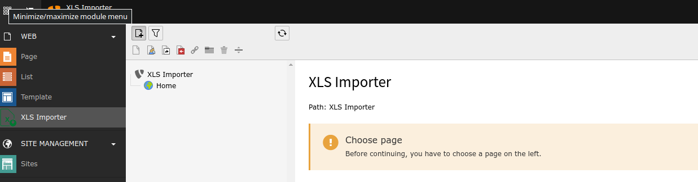

.. ==================================================
.. FOR YOUR INFORMATION
.. --------------------------------------------------
.. -*- coding: utf-8 -*- with BOM.

.. include:: ../Includes.txt

.. _introduction:

Introduction
------------

.. _what-does-it-do:

What does it do?
^^^^^^^^^^^^^^^^

This extension allows the import of data to every database table inside TYPO3
defined in TCA configuration.

.. _screenshots:

Screenshots
^^^^^^^^^^^

   The default view of the module.
