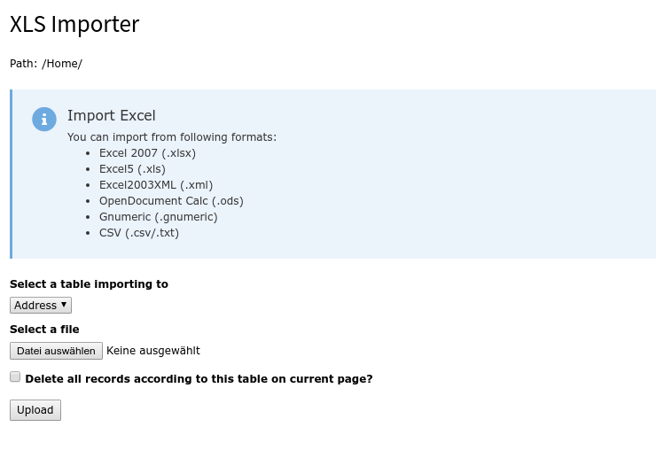
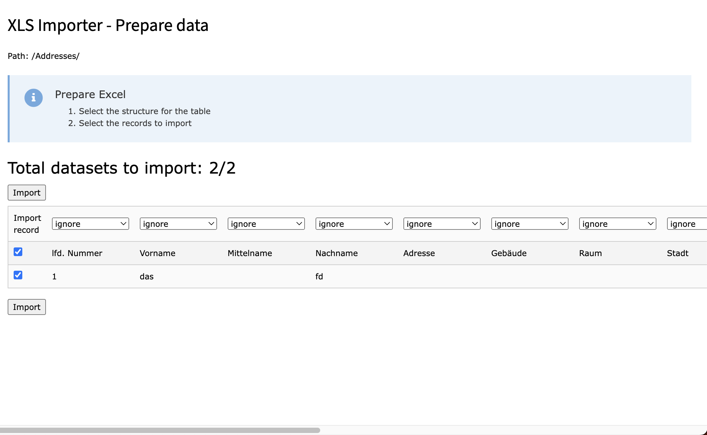
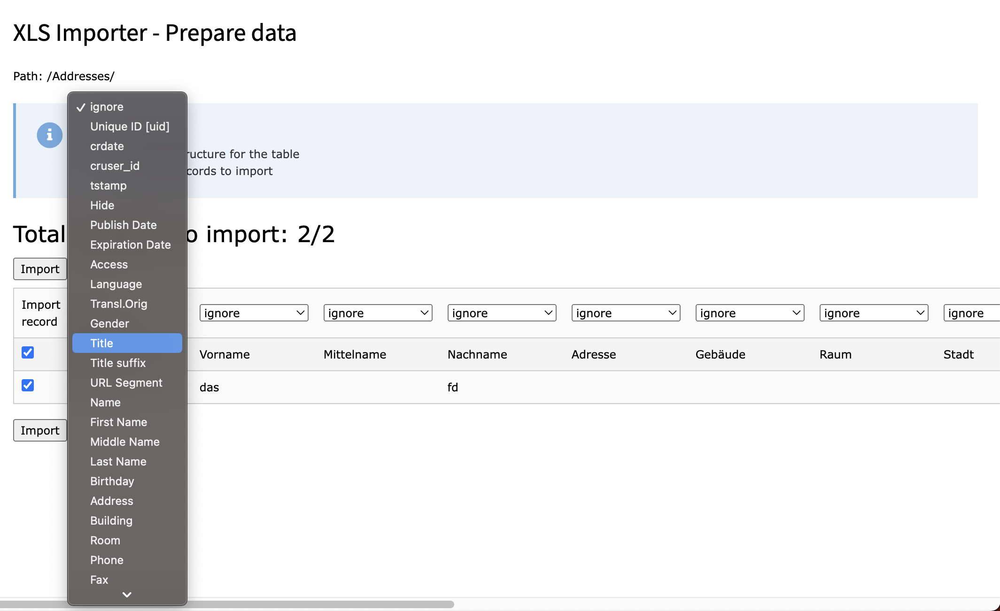
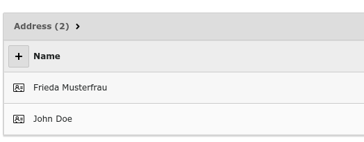

.. ==================================================
.. FOR YOUR INFORMATION
.. --------------------------------------------------
.. -*- coding: utf-8 -*- with BOM.

.. include:: ../Includes.rst.txt

.. _usage:

Usage
-----

.. figure:: ../Images/StandardView.png
   :alt: View with no page selected

   The default view of the module.

Beginning from here you can select a page inside the pagetree you want to import your data to.

   The view for selecting table and file for importing data.

Inside this view you can select your table you want to import to. As actual
supported files you can use all listed above file types.

The first checkbox allows you to select if the uploaded file is CP1252 encoded.
This is especially useful if you encounter problems with empty fields after
the import due to UTF-8 problems.

The second checkbox allows you to delete all records in the selected table on
the selected page.

For getting data updated instead of added, you have to define a row with the
uid of the corresponding TYPO3 record inside your Excel sheet. If you set
one column to uid, the system tries to update the existing dataset.

Use the update feature carefully.

The PID insert can only used by TYPO3 Backend Administrators, as the import
with pid will cause side effects.

   The view of the pre imported data with empty selects

You will get a preview of your data. Now you have to decide, to which column
your data has to be written. With the checkbox in the front you can exclude
data from getting imported, this is useful for header lines and empty lines
to avoid problems with the TCA import.

   An opened select for selecting the data column

Select for every column to which column inside the database this column has
to be added. If you choose ignore, the column is ignored. Selecting uid will
update the dataset with the uid inside this column instead of creating a new
one. Updating a dataset won't take effect on the pid, the data is stored. If
no uid is set, a new dataset is created at the current page. This allows to
mix up updating records and creating new ones with only one import.

After a successful import you will get a success message and your data is
imported.

   The data chosen above is imported to the current page
